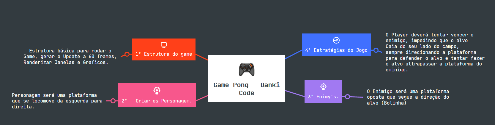

# Game Pong com Java

###  Aula de desenvolvimento de game com Java sem GAME ENGINIE

Nesta aula de desenvolvimento de Game com Java pela Danki CODE o foco foi a estrutura básica para o desnvolvimento 
de um game e a criação dos conceitos sobre como Gerar Frames e fazer o game rodar neles.
Além disso nesse desenvolvimento foi aprendido como renderizar a tela para rodar o 
game com Jframes e também como gerar formas na tela, desenvolvendo assim o player.
Além destes conceitos básicos de game foi addicionado a Interface KeyListener para adicionar eventos de teclas e 
editar a possição do Player conforme o movimento acionado em eixos X.

#### 1. Base para o game.

Na base foi definido a quantidade de FPS para este game, além de metodos para renderizar os Graficos e 
a lógica do game.

#### 2. Objetos Enemy, Player e Ball

Neste processo foram criados o Enemy, e o Player, que seguem a semelhaça de lógica 
sendo 2 retangulos de cores diferentes, onde o retangulo da região inferior é o player e o 
mesmo pode ser movimentado para a Esquerda ou direita com a tecla de diração.

Quando ao Enemy ele se move conforme a direção do Alvo a Ball;

A lógica da Ball é mais complexa ela precisa verificar quando o Objecto alcança as laterais para inverter o Eixo, a 
mesma segue eixos aleatórios, e se movimenta conforme o Eixo gerado.

#### 3. O movimento do Player

Para Mover o Player foram pegados Eventos de teclado, neste caso os botões da esquerda para direita que movimentam 
o objeto.

